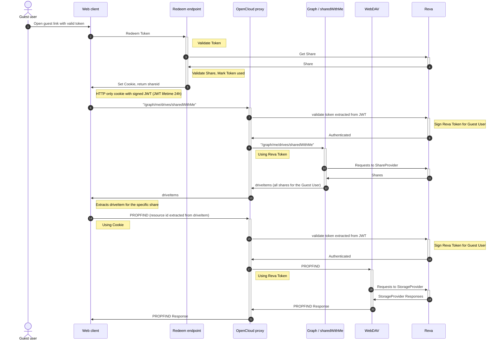

# auth-guest

The `auth-guest` service gives guest users access to a share without a full
OpenCloud account. When a share is created for a user of type
`USER_TYPE_GUEST`, the service issues a one-time guest link token; redeeming
that token exchanges it for a signed session cookie that authenticates the
guest.

It is disabled by default. Set `OC_ENABLE_GUEST_LINKS=true` to enable the guest
links feature and start the service.

## Overview

- **Consumes** the share lifecycle events `ShareCreated`, `ShareRemoved` and
  `ShareExpired`.
- **Publishes** the `GuestTokenCreated` event carrying the guest link token,
  so the link can be delivered to the guest.
- Exposes an unauthenticated endpoint that redeems the token and sets a
  session cookie.
- Stores only hashes of the token and deletes the stored record when the share
  is removed or expires.

## Guest links flow

The following sequence diagram describes the guest links flow:

## Token lifecycle

1. **Issue** — on the consumed `ShareCreated` event, where the grantee is a
   guest, the service generates a random secret and stores a record keyed by
   the hash of the share id. It then publishes the `GuestTokenCreated` event
   with the token.
2. **Redeem** — the guest posts the token to
   `POST /graph/v1beta1/extensions/org.libregraph/guestLinks/redeem`.
    The service validates the token and the share, marks the token as used
    and returns a signed JWT session token in a cookie plus the share's
    `permissionId` in the response body. Tokens are single-use.
3. **Cleanup** — on the consumed `ShareRemoved` or `ShareExpired` event, the
   stored record is deleted.

## Configuration

The service is configured via `AUTH_GUEST_*` environment variables or a
`auth-guest.yaml` file.

To run only the HTTP part, set `AUTH_GUEST_EVENTS_DISABLED=true`. To run only
the event consumer, set `AUTH_GUEST_HTTP_DISABLED=true`.

Relevant options:

- `AUTH_GUEST_SESSION_JWT_SECRET` — secret used to sign guest session tokens.
  It must differ from `OC_JWT_SECRET`.
- `AUTH_GUEST_JWT_COOKIE_NAME`, `AUTH_GUEST_JWT_TTL` — session cookie name and
  lifetime.
- `AUTH_GUEST_TOKENS_STORAGE_ROOT` — where guest link token records are stored.
- `AUTH_GUEST_SERVICE_ACCOUNT_ID`, `AUTH_GUEST_SERVICE_ACCOUNT_SECRET` — service
  account used to query the gateway for share metadata.
- `AUTH_GUEST_NUM_CONSUMERS` — number of concurrent event consumers.
- `OC_REVA_GATEWAY` — CS3 gateway used to look up shares.
